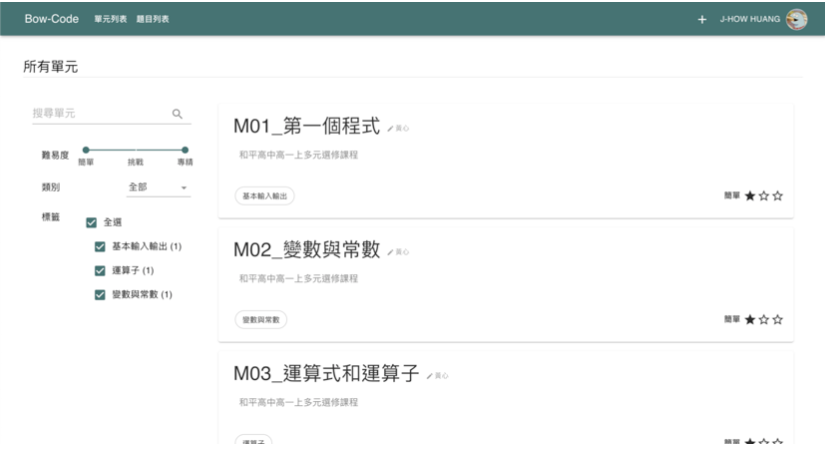
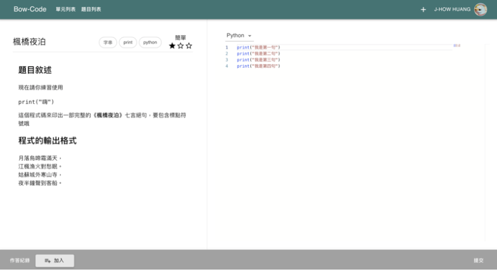

# System Introduction
CoDAI Classroom is a platform for programming teaching or self-learning. Users can not only create and share courses and compile and write projects, but also use this platform to achieve communication among users.

# Concept Development
After the new policy on education in Taiwan, the role of IT field in education has been elevated, but the problem of shortage of teachers in IT field in Taiwan's national school education is reflected. In most rural areas, information technology courses need to be taught by teachers of other subjects.
#### This phenomenon causes three main problems.
  - These teachers do not have enough experience to guide students of different levels.
  - The threshold for writing materials is very high for non-specialized teachers, who often have to follow textbooks.
  - Teachers are not familiar with using external teaching resources.
#### Thus, we come up with a solution to solve these problems.

# Core Features

<table>
  <tr>
    <td></td>
    <td></td>
  </tr>
 </table>

- ### Lesson Plans System
The system is designed to allow users to browse the course content created publicly by other users on CoDAI. You can create your own lesson plans. The content of the lesson plan can include courses and problems, and even import others' publicly available courses into their own lesson plans.

- ### Problem System
Users can create description, generate test data, and create coding templates to construct a programming problem. Users also can navigate and practice these public problems. The answers of problems are judged by Judge0 server.

- ### Classroom System
We have divided the users into "teachers" and "students". Teachers can create classes on CoDAI and invite students to join. All students in the class can view the materials, assignments, and even a discussion allowing students to communicate with the teacher for each class. In addition, teachers can view and manage all students' answers and export to Excel files.

# Influence
We have also applied the CoDAI Classroom to the programming education of high schools in Taiwan. For example, in Heping High School, we created a class for students to join based on the content of their high school information teacher's course. Teachers actually taught students more conveniently in the classroom because CoDAI is a platform that integrates course content and questions together. Teachers did not have to use other online judgement systems.


# Future Outlook
Our expectation for CoDAI is that it will cover more national and high school information education in the future. The main feature of CoDAI is the "lesson plans sharing" function, which can provide a good basis for new information teachers to create their own materials, or for teachers in rural areas with insufficient resources to create materials. Therefore, our future goal is to have more and more people use CoDAI as a platform for teaching and learning.

# Demo Video
