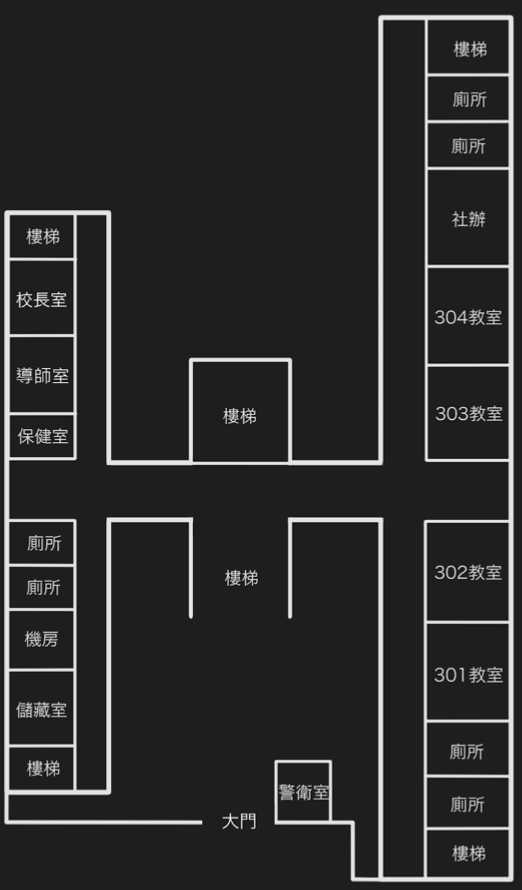

# Game Introduction
Invisible is a single-player puzzle game. Players can explore the high school at night to find clues and resources.

# Ideation of Invisible
- ### The background story of Invisible
The protagonist's childhood playmate jumped to his death at the school, but teachers and classmates are evasive about the details. In order to investigate the truth, the protagonist went into the campus at night to look for clues, but encounters an unseen presence...
- ### The gameplay
The player use limited resources and environmental elements to find and hide from invisible enemies
- ### Core elements
Puzzles + Survival + Fear

# Scene & Map

<table>
  <tr>
    <td></td>
    <td></td>
  </tr>
 </table>

# Interaction

- Splash effect
- Footprint effect
- Weather change
- Different footprints based on different floor


- Multiple dialogs
- Facial expressions

# Some other props and scenes


# Demo Video
